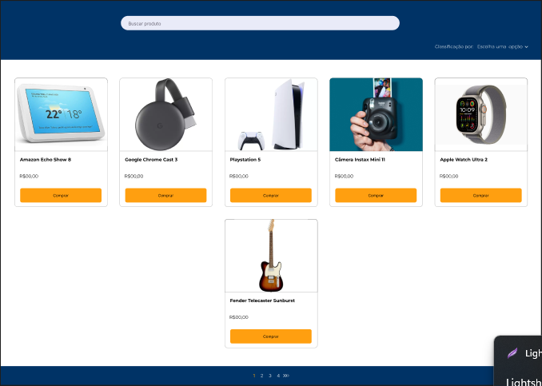

# LISTA DE PRODUTOS

Link para o Figma:

https://www.figma.com/file/FGKL0cmiE7nBJfxQiNam9y/Untitled?node-id=6%3A526&mode=dev

Desafio: 
O desafio consiste em criar uma interface web que exiba uma lista de produtos a partir de um arquivo JSON fornecido. Você será responsável por criar um mockup da interface utilizando a ferramenta Figma e, em seguida, implementar essa interface utilizando qualquer linguagem/framework de frontend de sua escolha (por exemplo, HTML, CSS, JavaScript, Bootstrap, Angular).

Passos do Desafio:
1. Mockup no Figma:
   - Crie um mockup da interface web que exibirá a lista de produtos.
   - O mockup deve incluir uma página inicial que exibirá os produtos em forma de lista ou qualquer outro formato que você considerar adequado.
   - Certifique-se de que o design seja atraente e responsivo.

2. Implementação Frontend:
   - Após concluir o mockup, implemente a interface usando uma linguagem de frontend à sua escolha.
   - Carregue os dados do arquivo JSON (fornecido em anexo) para exibir a lista de produtos na página.
   - Certifique-se de que a interface seja responsiva e funcional em diferentes tamanhos de tela.

3. Requisitos Extras:
   - Crie um botão ou elemento que permita ao usuário filtrar os produtos por categoria.
   - Adicione funcionalidade para classificar os produtos por preço (do mais baixo para o mais alto e vice-versa).
   - Torne os produtos clicáveis para que, ao clicar em um produto, detalhes adicionais do produto sejam exibidos.

Critérios de Avaliação:
1. Qualidade do design da interface.
2. Implementação funcional e responsiva.
3. Capacidade de carregar e manipular dados JSON.
4. Funcionalidades extras, como filtros e ordenação.
5. Organização do código e boas práticas de desenvolvimento.

